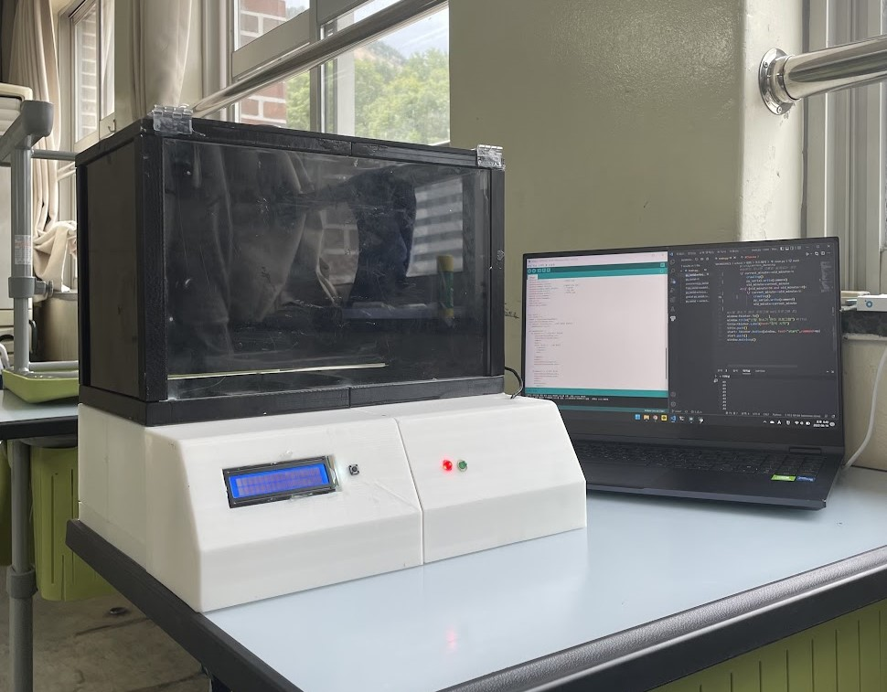
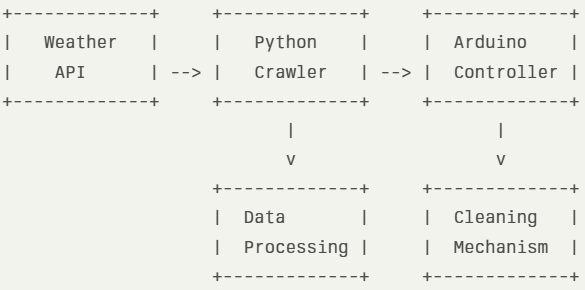

# 🌟 신발 자동 청소기 (ASCM: Auto Shoes Clean Machine) 🌟



## 📌 프로젝트 소개

ASCM(Auto Shoes Clean Machine)은 날씨 데이터를 기반으로 신발을 자동으로 관리하고 청소해주는 혁신적인 기계입니다! 🌤️👟✨

Python을 활용한 웹 크롤링으로 실시간 날씨 정보를 수집하고, 이를 아두이노와 연동하여 스마트한 신발 관리 시스템을 구현했습니다.

## 🛠️ 기술 스택

- **Python** 🐍: 웹 크롤링 및 데이터 처리
- **Arduino** 🤖: 하드웨어 제어
- **Beautiful Soup** 🍲: 웹 스크래핑
- **Requests** 📡: HTTP 요청 처리

## 🌈 주요 기능

1. **실시간 날씨 크롤링** 🌡️
   - 네이버 날씨 정보를 자동으로 수집
   - 온도, 습도, 강수 확률 등 다양한 기상 데이터 추출

2. **스마트 청소 시스템** 🧼
   - 날씨 데이터에 기반한 맞춤형 신발 관리
   - 미세먼지 농도에 따른 집중 청소 모드

3. **자동 건조 기능** 🌬️
   - 습도에 따른 최적의 건조 시간 설정
   - 자외선 살균으로 신발 위생 관리

4. **사용자 친화적 인터페이스** 📱
   - LED 디스플레이로 현재 상태 표시
   - 모바일 앱 연동으로 원격 제어 가능

## 🏗️ 시스템 아키텍처



## 🚀 설치 및 실행 방법

1. 레포지토리 클론
```git clone https://github.com/your-username/ASCM.git```

2. 필요한 라이브러리 설치
```pip install -r requirements.txt```

3. Arduino IDE에서 `ASCM.ino` 파일 업로드

4. Python 스크립트 실행
```python main.py```


## 👥 팀 멤버

- 🧑‍💻 홍길동: 프로젝트 리더 & 백엔드 개발
- 👩‍💻 김철수: 하드웨어 설계 & 아두이노 프로그래밍
- 🧑‍🔬 이영희: 데이터 분석 & 알고리즘 최적화

## 📞 문의하기

프로젝트에 관한 문의사항이 있으시면 언제든 연락주세요! 📧

이메일: ascm@example.com

## 🙏 감사의 말

ASCM 프로젝트에 관심을 가져주셔서 감사합니다. 당신의 신발을 깨끗하고 건강하게 유지하는 데 도움이 되길 바랍니다! 👟💖

---

⭐ 이 프로젝트가 마음에 드셨다면 스타를 눌러주세요! ⭐

